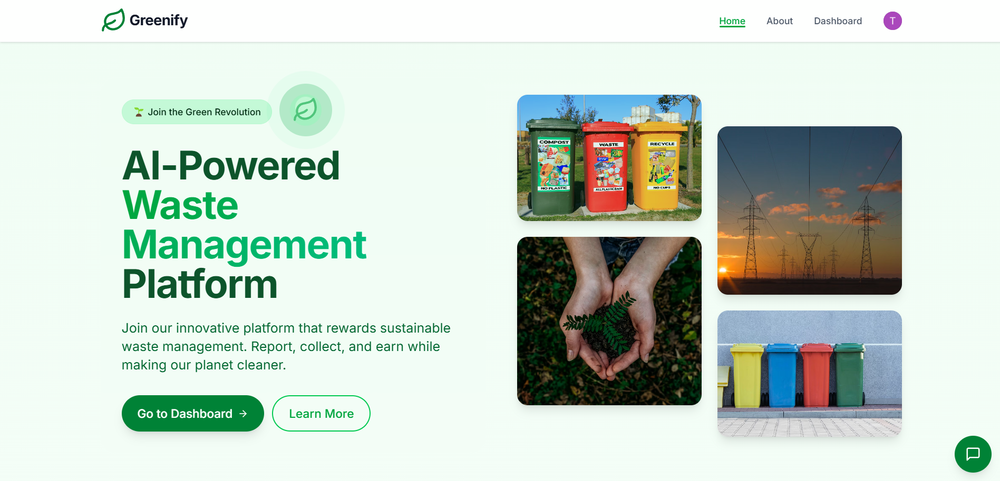
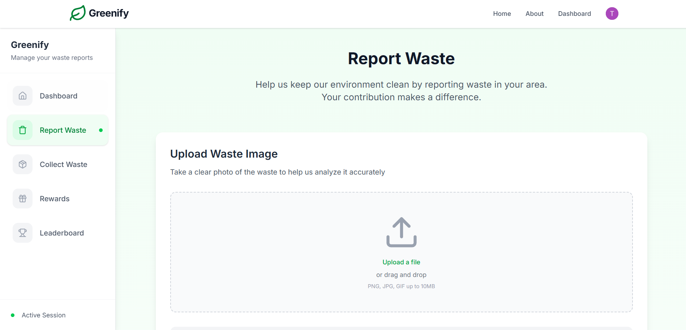
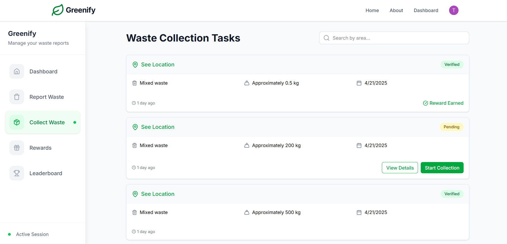
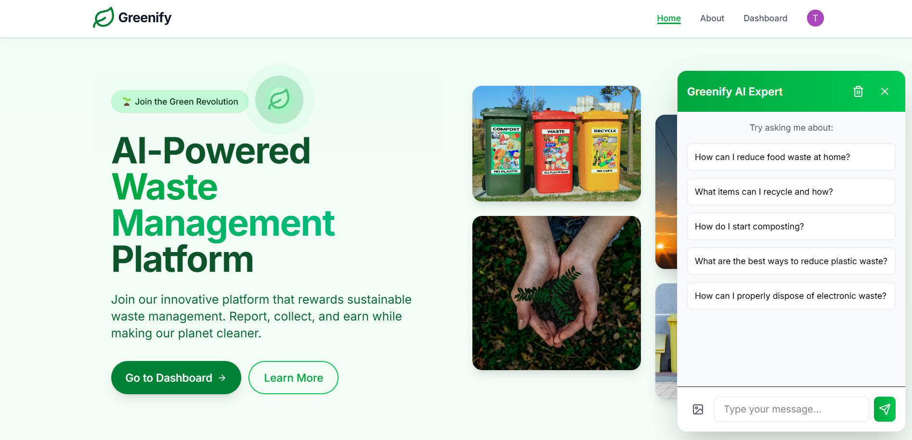
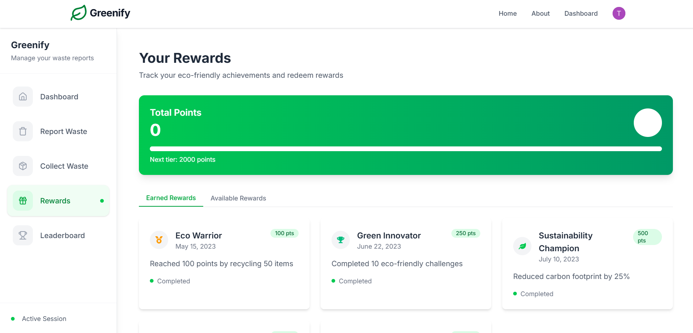

# ♻️ Greenify – AI-Powered Waste Management Platform

Greenify is a smart, AI-driven web platform that redefines how waste is identified, categorized, and collected. Powered by Gemini LLM, geospatial mapping, and real-time task automation, Greenify empowers citizens and municipalities to manage waste sustainably.

---

## 🌟 Key Highlights

♻️ AI-Based Waste Classification via image uploads using Gemini LLM

📍 Live Location Tracking and route management using Google Maps API

🧠 Expert Chatbot Integration for sustainability tips & verification

🏆 Gamification System to promote eco-conscious habits

🗂️ Role-based Dashboards for Users and Collectors with automated backend AI processing

🔐 User Authentication via Clerk for secure access and session management

🗑️ Waste Tracking: Track real-time waste collection, type, quantity, and location using Google Maps API; Users can input waste generated manually alongside real-time updates from collectors.

🔍 AI Waste Verification: Verify waste categorization by comparing uploaded images with AI-powered classification using Gemini LLM; ensures the accuracy of waste sorting and categorization.

---

## 🧩 Tech Stack

| Layer        | Technology Used                           |
|--------------|--------------------------------------------|
| Frontend     | [Next.js](https://nextjs.org/) (App Router, TypeScript) |
| Styling      | [Tailwind CSS](https://tailwindcss.com/)  |
| Backend/API  | Next.js Route Handlers (Serverless Functions) |
| AI Model     | [Gemini API](https://ai.google.dev/) for LLM-based waste classification and verification |
| Database     | [Neon](https://neon.tech/) (PostgreSQL) + [Drizzle ORM](https://orm.drizzle.team/) |
| Authentication | [Clerk](https://clerk.dev/) for user auth and session handling |
| Maps & GPS   | Google Maps JavaScript API, HTML5 Geolocation |
| Hosting      | [Vercel](https://vercel.com/)             |

---

## 🖼️ Screenshots

### 🏠 Homepage  


### 📊 Waste Report Overview  


### 📥 Waste Collection Interface  


### 🧠 Gemini AI Chatbot  


### 🎯 Rewards & Gamification  


### ⚙️ Configuration Files
- `tailwind.config.js`
- `tsconfig.json`

---

## 📦 Installation & Setup

### 🔧 Prerequisites

Make sure you have the following installed:

- Node.js (v18+)
- pnpm / npm / yarn
- Google Cloud API key (for Maps + Gemini)
- Neon DB project with PostgreSQL
- Clerk project (for authentication)
- Vercel account (for deployment)

---

### 📁 Clone the Repository

```bash
git clone https://github.com/your-username/greenify.git
cd greenify
```

---

### 🧑‍💻 Local Development

#### 1. Install Dependencies

```bash
npm install
# or
pnpm install
```

#### 2. Setup Environment Variables

Create a `.env.local` file and add the following:

```env
DATABASE_URL=your_neon_postgres_url
GOOGLE_MAPS_API_KEY=your_google_maps_api_key
GEMINI_API_KEY=your_gemini_llm_key
CLERK_PUBLISHABLE_KEY=your_clerk_publishable_key
CLERK_SECRET_KEY=your_clerk_secret_key
NEXT_PUBLIC_BASE_URL=http://localhost:3000
```

#### 3. Start Dev Server

```bash
npm run dev
```

App will run on: [http://localhost:3000](http://localhost:3000)

---

## 🚀 Deployment

This app is **Vercel-ready**.

### To deploy:

1. Push code to GitHub
2. Import repo into [Vercel](https://vercel.com/)
3. Add the `.env` variables in the Vercel dashboard
4. Deploy!

---

## 🧠 How It Works

- Users upload waste images → processed by Gemini LLM for classification
- Gemini verifies results & categorizes waste
- Collectors receive auto-assigned tasks based on location
- Points are rewarded for verified pickups → shown in user dashboard
- AI Chatbot guides users on correct disposal & eco habits
- Clerk handles secure user login, signup, and session management

---

## 🔄 Folder Structure (Simplified)

```
/app               → Next.js App Router pages & routes
/components        → Reusable UI components (chatbot, modals, etc.)
/lib               → Utility functions, db setup (drizzle, neon)
public/screenshots → Add your screenshots here
.env.local         → Environment variables
```

---

## 🧪 Testing

- Frontend: Manual testing + Playwright (optional)
- Backend: API tests using Postman
- Maps & GPS: Simulated location testing (Chrome Dev Tools)

---

## 📈 Future Enhancements

- Push notifications for collectors
- Smart route optimization using GIS
- AI model fine-tuning with regional datasets
- Mobile app via Expo/React Native

---

## 📄 License

This project is licensed under the MIT License.  
See [LICENSE](LICENSE) for more details.

---
